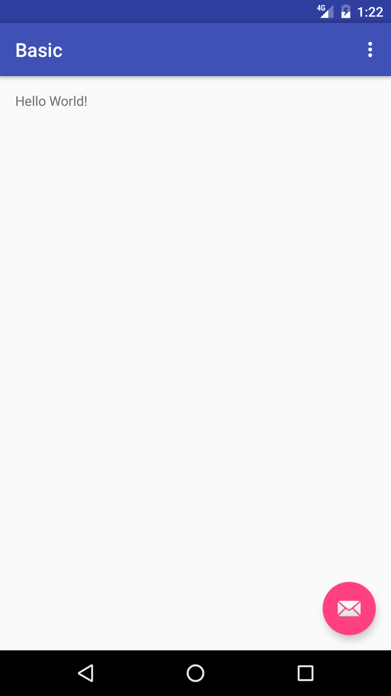

# IBM Cloud App ID
Android Sample App Template for the IBM Cloud App ID service. The App ID Dashboard overwrites the following files with the user's information when they download an Android sample app:
* app/src/main/res/values/credentials.xml
* app/src/main/res/values/strings.xml
* app/src/main/java/com/ibm/cloud/appid/android/sample/appid/StartupActivity.java
* app/src/main/java/com/ibm/cloud/appid/android/sample/appid/MainActivity.java

[![IBM Cloud powered][img-ibmcloud-powered]][url-ibmcloud]
[![Android Badge][img-android-badge]][url-android-badge]
[![Travis][img-travis-master]][url-travis-master]
[![Coveralls][img-coveralls-master]][url-coveralls-master]
[![Codacy][img-codacy]][url-codacy]
[![License][img-license]][link-to-license]

[![GithubWatch][img-github-watchers]][url-github-watchers]
[![GithubStars][img-github-stars]][url-github-stars]
[![GithubForks][img-github-forks]][url-github-forks]

## Table of Contents
* [Requirements](#requirements)
* [Run](#run)
* [Apache License](#apache-license)
* [IBM License](#ibm-license)

## Requirements

* A [IBM Cloud](https://www.ibm.com/cloud/) Account
* [Android Studio](https://developer.android.com/studio/index.html) and [Gradle](https://gradle.org/gradle-download/)

## Run

Click **Run** to start the app in Android Studio.

The application has built in integration points for the Mobile Analytics and Push Notifications services.

## Apache License
This package contains code licensed under the Apache License, Version 2.0 (the "License"). You may obtain a copy of the License at http://www.apache.org/licenses/LICENSE-2.0 and may also view the License in the LICENSE file within this package.

## IBM License
Copyright (c) 2018 IBM Corporation

Permission is hereby granted, free of charge, to any person obtaining a copy of this software and associated documentation files (the "Software"), to deal in the Software without restriction, including without limitation the rights to use, copy, modify, merge, publish, distribute, sublicense, and/or sell copies of the Software, and to permit persons to whom the Software is furnished to do so, subject to the following conditions:

The above copyright notice and this permission notice shall be included in all copies or substantial portions of the Software.

THE SOFTWARE IS PROVIDED "AS IS", WITHOUT WARRANTY OF ANY KIND, EXPRESS OR IMPLIED, INCLUDING BUT NOT LIMITED TO THE WARRANTIES OF MERCHANTABILITY, FITNESS FOR A PARTICULAR PURPOSE AND NONINFRINGEMENT. IN NO EVENT SHALL THE AUTHORS OR COPYRIGHT HOLDERS BE LIABLE FOR ANY CLAIM, DAMAGES OR OTHER LIABILITY, WHETHER IN AN ACTION OF CONTRACT, TORT OR OTHERWISE, ARISING FROM, OUT OF OR IN CONNECTION WITH THE SOFTWARE OR THE USE OR OTHER DEALINGS IN THE SOFTWARE.

[img-ibmcloud-powered]: https://img.shields.io/badge/ibm%20cloud-powered-blue.svg
[url-ibmcloud]: https://www.ibm.com/cloud/

[img-android-badge]: https://img.shields.io/badge/platform-android-lightgrey.svg?style=flat
[url-android-badge]: https://developer.android.com/index.html

[img-travis-master]: https://travis-ci.org/ibm-cloud-security/app-id-sample-android.svg?branch=master
[url-travis-master]: https://travis-ci.org/ibm-cloud-security/app-id-sample-android?branch=master

[img-coveralls-master]: https://coveralls.io/repos/github/ibm-cloud-security/app-id-sample-android/badge.svg
[url-coveralls-master]: https://coveralls.io/github/ibm-cloud-security/app-id-sample-android

[img-codacy]: https://api.codacy.com/project/badge/Grade/ab5b96dce496408da630617b6e95f375
[url-codacy]: https://www.codacy.com/app/ibm-cloud-security/app-id-sample-android

[img-license]: https://img.shields.io/npm/l/ibmcloud-appid.svg
[link-to-license]: #apache-license

[img-github-watchers]: https://img.shields.io/github/watchers/ibm-cloud-security/app-id-sample-android.svg?style=social&label=Watch
[url-github-watchers]: https://github.com/ibm-cloud-security/app-id-sample-android/watchers
[img-github-stars]: https://img.shields.io/github/stars/ibm-cloud-security/app-id-sample-android.svg?style=social&label=Star
[url-github-stars]: https://github.com/ibm-cloud-security/app-id-sample-android/stargazers
[img-github-forks]: https://img.shields.io/github/forks/ibm-cloud-security/app-id-sample-android.svg?style=social&label=Fork
[url-github-forks]: https://github.com/ibm-cloud-security/app-id-sample-android/network
